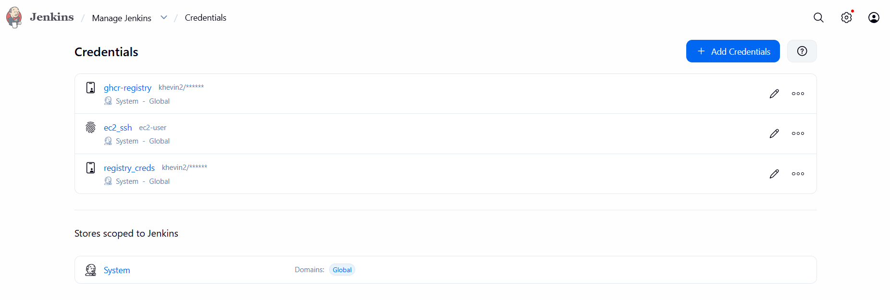
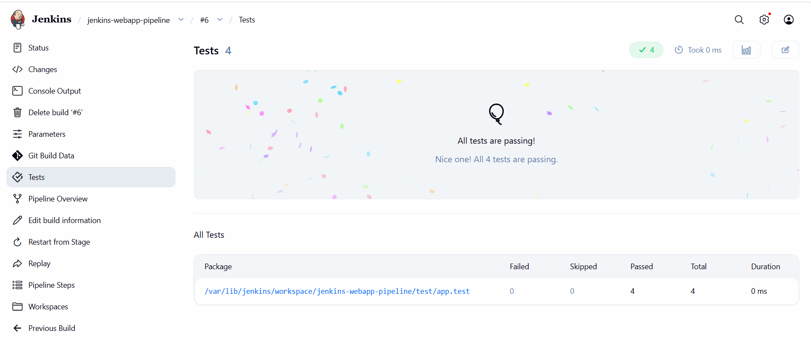
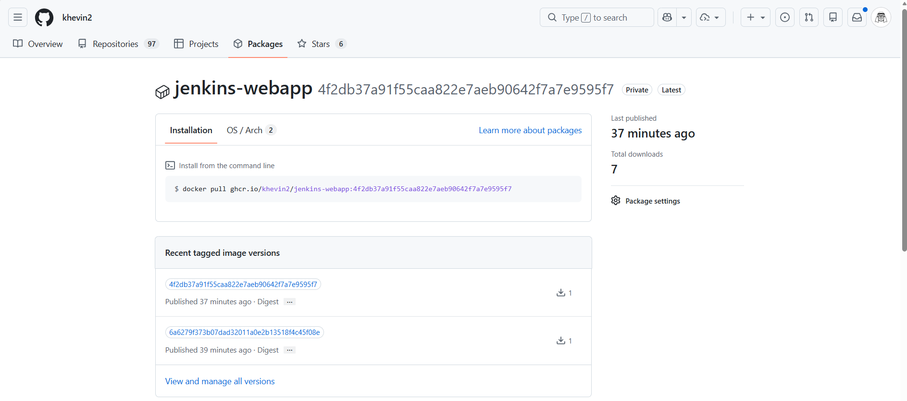
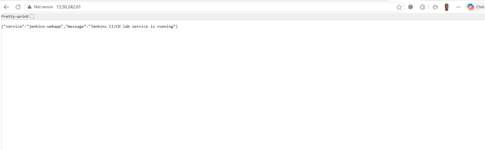

# Jenkins webapp observability and security lab

This Express service is built, scanned, published, and deployed by Jenkins on a
small dedicated controller-runner. GitHub push events trigger the pipeline through
a HTTPS webhook; deployment uses an immutable GHCR image digest and strict SSH to
a separate Amazon Linux 2023 application host. A privately peered Prometheus and
Grafana stack supplies RPS, p95 latency, 5xx percentage, and host health, while
CloudWatch, CloudTrail, and GuardDuty provide centralized logging and audit proof.

## Verified status

A GitHub-push-triggered Jenkins run on 2026-08-24 completed successfully for
commit `65096a2cf28bf49a300b0a177cd5a2eb1cd74eaa`.

- The run was started by GitHub, not by a manual Jenkins action.
- All four Jest tests passed and JUnit results were published.
- Repository and image Trivy gates passed before publication and deployment.
- Jenkins deployed
  `ghcr.io/khevin2/jenkins-webapp@sha256:24e2027b90385c23dd9d86a9f2319e930cd93972a10ec0e170a5585e08c97835`.
- The application container was running and healthy; `/health` returned the
  expected service status.
- `jenkins-webapp:rollback` retained the previous immutable image digest
  `sha256:0a7f183d067c264e45fd67f32e82d1ee206c03ebfb820bd78041e9b910fbec0d`.

The current monitoring verification is recorded separately on 2026-08-30. All
four Prometheus targets were `UP` after recovery; an approved >5% 5xx test
progressed from Pending to Firing after five minutes and then Resolved. The
normal non-root container was restored with fault injection disabled. This was
controlled traffic, not an incident; see
[the sanitized timestamped record](evidence/20260830-phase11-live-verification.md).

## Architecture

[Open the editable diagram](architecture.drawio) in diagrams.net.

- **Jenkins CI/CD Architecture** shows the GitHub, Jenkins controller-runner,
  Nginx/TLS, GHCR, and application-host boundaries.
- **Pipeline execution** shows the event-to-deployment stages, security gates,
  immutable digest hand-off, health validation, rollback retention, and cleanup.
- **Technical design** shows the private monitoring VPC, VPC peering, Grafana
  edge, CloudWatch logs, CloudTrail archive, GuardDuty, and secret boundaries.

GitHub can reach only the HTTPS webhook route. AWS permits HTTPS to Nginx, while
Nginx refreshes GitHub's published webhook source ranges and proxies only
`/github-webhook/` to Jenkins on loopback. The Jenkins UI remains restricted to
approved administrator CIDRs.

## Pipeline behavior

```text
GitHub push -> webhook -> Jenkins
  -> checkout -> install/check -> Jest metric tests + JUnit
  -> observability/infrastructure static gates -> Trivy repository gate
  -> Docker build -> Trivy image gate
  -> immutable GHCR digest -> SSH deployment -> health check
  -> retain rollback tag -> bounded runtime cleanup
```

The pipeline validates a temporary candidate before cutover. It then deploys the
exact pushed image digest, not a mutable tag. If post-cutover health does not
recover, it restores the previous image. Runtime Cleanup removes only the named
candidate and dangling layers, leaving the active image and
`jenkins-webapp:rollback` available.

## Jenkins job configuration

Install Pipeline, Git, Credentials Binding, Docker Pipeline, SSH Agent, NodeJS,
GitHub, JUnit, and Timestamper plugins. Configure the NodeJS installation named
`NodeJS24`. The controller-runner also needs Docker and `jq` for the
non-mutating configuration gates. Trivy and pinned `promtool` run in
digest-pinned containers and need no Jenkins plugins or separate host installs.

Create a Pipeline-from-SCM job using this repository and create only these
credential IDs:

| ID | Type | Purpose |
| --- | --- | --- |
| `registry_creds` | Username with password | GHCR push and deployment pull |
| `ec2_ssh` | SSH Username with private key | Deployment SSH login |

After independently verifying the application host's ED25519 fingerprint, add its
key to the Jenkins runtime user's `known_hosts`. The pipeline uses
`StrictHostKeyChecking=yes`; never weaken it.

Set this Jenkins global environment variable under **Manage Jenkins -> System ->
Global properties -> Environment variables**:

```text
APPLICATION_DEPLOY_HOST=<approved application private DNS name or IP>
```

A manual `DEPLOY_HOST` parameter overrides this value. A GitHub webhook cannot
supply Jenkins build parameters, so webhook-triggered builds use
`APPLICATION_DEPLOY_HOST`.

## Configure the webhook

1. Provision the controller with HTTPS and Nginx, then set
   `enable_jenkins_webhook_ingress = true` in the ignored live Terraform input.
   Review and apply a saved Terraform plan.
2. Keep the Pipeline `githubPush()` trigger in the Jenkinsfile. Run the job once
   after adding it so Jenkins saves the trigger.
3. In the GitHub repository, create an active webhook for
   `https://ci.kheven.me/github-webhook/`, use `application/json`, enable SSL
   verification, and subscribe to push events.
4. Push a small change or redeliver a failed **push** event. A valid run begins
   with a GitHub-push cause in Jenkins.

## Screenshot evidence

These older sanitized captures are supplemental baseline evidence. They contain no
credential values, tokens, private keys, or private host details. Current webhook,
digest, health, and rollback verification is recorded above.









## Repository layout

```text
src/                 Express application and server
test/                Jest/Supertest tests and JUnit reporter
Dockerfile           Non-root production image with health check
Jenkinsfile          Webhook-triggered build, scan, publish, and deploy workflow
infra/               Terraform roots and child modules for app and Jenkins hosts
ansible/             Docker and Jenkins-controller configuration playbooks
docs/RUNBOOK.md      Provisioning, webhook, verification, rollback, and recovery
architecture.drawio  Editable two-page architecture and pipeline diagram
monitoring/          Hardened digest-pinned Prometheus/Grafana runtime
prometheus.yml       Private Prometheus scrape and recording-rule configuration
evidence/            Sanitized executed evidence
```

The monitoring stack publishes only Nginx HTTPS through an unprivileged proxy.
Grafana and the IP-restricted, Basic-Authenticated Prometheus UI use exact
virtual hosts; Prometheus's native listener, Grafana's native listener, and Node
Exporter remain on internal networks. See [the monitoring security
boundary](monitoring/README.md), the single [`infra/live`](infra/live) Terraform
root, and the validation scripts for structural checks. Cloud mutations always
require a reviewed saved plan.

## Local quick start

Prerequisites: Node.js 24, npm, and Docker Engine for container commands.

```bash
npm ci
npm run check
npm test -- --runInBand
npm start
curl --fail http://127.0.0.1:3000/health

docker build --tag jenkins-webapp:local .
docker run --detach --rm --name jenkins-webapp-local \
  -p 8081:3000 -p 127.0.0.1:9464:9464 jenkins-webapp:local
curl --fail http://127.0.0.1:8081/health
curl --fail http://127.0.0.1:9464/metrics
docker stop jenkins-webapp-local
```

The container runs as UID/GID 10001, serves the application on port 3000, exposes
Prometheus metrics on the separate port 9464, and has a Docker health check. The
deployed service maps host port 80 to 3000 and host port 9464 to the metrics
listener. AWS security-group rules must keep ports 3000 and 9464 off the public
internet; only the future monitoring VPC may scrape `:9464/metrics`.

## Operations and evidence

Terraform, Ansible, Jenkins, webhook, verification, rollback, cleanup, and
recovery steps are in the [runbook](docs/RUNBOOK.md). Every reviewer-facing claim
should be backed by sanitized evidence in [the evidence index](evidence/README.md).
Never commit credentials, tokens, private keys, or unredacted endpoint captures.

## Submission artifacts

The root [prometheus.yml](prometheus.yml), provisioned
[Grafana dashboard](monitoring/grafana/dashboards/webapp-observability.json),
editable [architecture.drawio](architecture.drawio), and sanitized evidence are
submission artifacts. The concise two-page report is maintained in
[Markdown](docs/observability-security-report.md) and rendered as
`docs/observability-security-report.pdf` by `scripts/render-phase12-report.js`.
