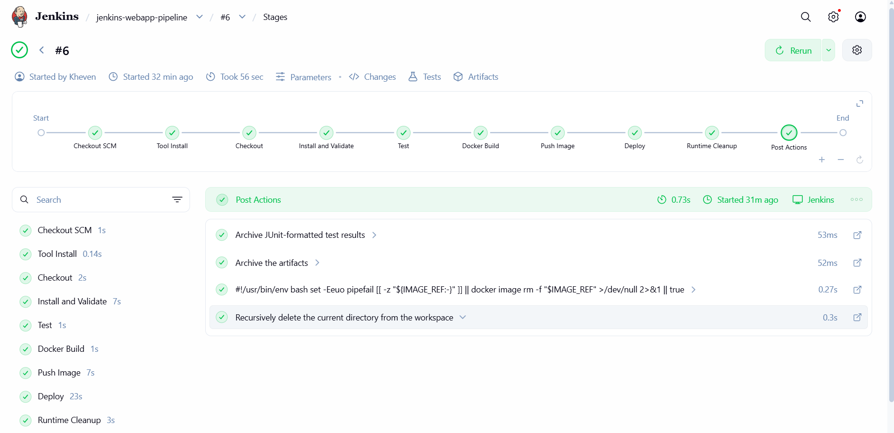
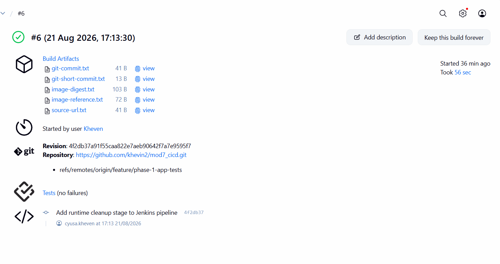
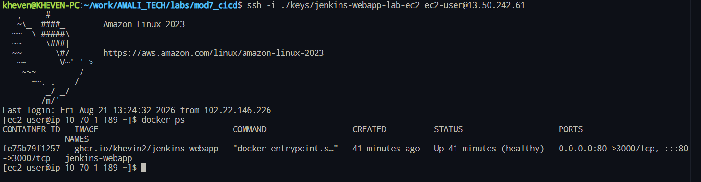

# Jenkins CI/CD web service

This Express service is delivered through Jenkins: locked dependency installation,
tests, blocking Trivy repository and image scans, a non-root Docker build,
immutable GHCR push, and strict-SSH deployment to one Amazon Linux 2023 EC2 host.

## Verified status

Sanitized evidence from 2026-08-21 records Jenkins build #4 completing Checkout,
Install and Validate, Test, Docker Build, Push Image, and Deploy. It deployed
ghcr.io/khevin2/jenkins-webapp@sha256:c1c44a2ba4737f92edf4c08c1f34ed1dcce0b8a03b7275d7b4faeacbd3033bf8.
EC2 local and public HTTP checks returned HTTP 200 with a healthy port-80
container, and the browser capture is included below.

Build #4 predates the current Trivy Repository Scan, Trivy Image Scan, and Runtime
Cleanup stages. Those stages require a fresh successful Jenkins build before their
execution can be claimed. See [the evidence index](evidence/README.md) for scope.

## Architecture

[Open the editable diagram](architecture.drawio) in diagrams.net. It shows only the
essential flow: GitHub source, Jenkins, GHCR, and the deployed application on EC2.

AWS components identify the AWS Cloud, VPC, and EC2 host. GitHub, Jenkins, and
GHCR remain outside the AWS boundary because they are external to this deployment.

The diagram documents the deployment flow: Jenkins checks out from GitHub,
security-scans the repository and built image, pushes an immutable commit image to
GHCR, deploys that digest by strict SSH, and serves it from EC2 on port 80.

The registry host, image repository, and registry credential ID are fixed trusted
constants in the Jenkinsfile rather than user-controlled build parameters. Jenkins
references registry_creds for GHCR username/password and ec2_ssh for the SSH
private key. Values, host addresses, and private keys are not stored in source.

The current deployment performs candidate health validation followed by in-place
replacement on one host. It is not represented as blue-green or canary. See the
[deployment strategy comparison](docs/DEPLOYMENT_STRATEGIES.md) for the release,
rollback, cost, and operational trade-offs.

## Screenshot evidence

These captures are sanitized and complement the command-based evidence index.
They show no credential values, tokens, private keys, or private host details.

### Jenkins

### Registry and deployed service

## Repository layout

~~~text
src/                 Express application and server
test/                Jest/Supertest tests
Dockerfile           Non-root production image with health check
Jenkinsfile          Build, publish, deploy, and constrained cleanup workflow
infra/               Composition-only Terraform roots and child modules
ansible/             Docker playbook and ignored host inventory
docs/RUNBOOK.md      Setup, security gates, verification, rollback, cleanup
docs/DEPLOYMENT_STRATEGIES.md
                     Blue-green and canary comparison
evidence/            Sanitized executed evidence
~~~

## Local quick start

Prerequisites: Node.js 24, npm, and Docker Engine for container commands.

~~~bash
npm ci
npm run check
npm test -- --runInBand
npm start
curl --fail http://127.0.0.1:3000/health
~~~

~~~bash
docker build --check .
docker build --tag jenkins-webapp:local .
docker run --detach --rm --name jenkins-webapp-local -p 8081:3000 jenkins-webapp:local
curl --fail http://127.0.0.1:8081/health
docker stop jenkins-webapp-local
~~~

The container runs as UID/GID 10001, listens on port 3000, and has a Docker health
check. Deployment maps host port 80 to 3000; do not expose port 3000 in the EC2
security group.

## Jenkins job configuration

1. Install Pipeline, Git, Credentials Binding, Docker Pipeline, SSH Agent, and
   NodeJS plugins; configure the NodeJS tool named NodeJS24. Trivy runs from its
   pinned container image and does not require a Jenkins plugin.
2. Create a Pipeline-from-SCM job using this repository Jenkinsfile on an agent
   that can run Git, Docker, Node.js, and SSH and can reach Docker Hub, GHCR, and
   the Trivy vulnerability databases.
3. Create system credentials without storing their values in source:

   | ID | Type | Purpose |
   | --- | --- | --- |
   | registry_creds | Username with password | GHCR username and package token |
   | ec2_ssh | SSH Username with private key | Deployment login |

4. After an out-of-band host-key check, add the trusted EC2 ED25519 key to the
   Jenkins runtime user known_hosts. Never disable strict checking.
5. Set DEPLOY_HOST to the approved DNS name/IP; DEPLOY_USER defaults to ec2-user
   and DEPLOY_PORT defaults to 80. The trusted registry values are fixed in the
   Jenkinsfile and are not build parameters.

The job scans repository dependencies, Terraform, Dockerfile configuration, and
secrets before building. It then scans the built image before any registry login
or push. Fixable HIGH or CRITICAL findings fail the build. Successful builds
commit-tag the image, deploy its immutable digest, archive non-secret Trivy JSON,
metadata, and JUnit results, then delete the workspace.

## Operations and evidence

Terraform bootstrap/live commands, Ansible host configuration, Jenkins operation,
verification, rollback, cleanup, and recovery steps are in the
[runbook](docs/RUNBOOK.md). Every executed claim and its limitation is mapped in
[evidence/README.md](evidence/README.md). Original unredacted captures remain
outside version control.

## Platform decision

Amazon Linux 2023 intentionally replaces the assignment's Amazon Linux 2 reference.
[Amazon Linux 2 reached end of support on 2026-06-30](https://aws.amazon.com/amazon-linux-2/),
and AWS recommends migration to Amazon Linux 2023. This repository therefore uses
the supported platform while retaining the required EC2 deployment model.

This is a single-host deployment. Candidate validation reduces risk but container
replacement on port 80 causes brief downtime; use the documented rollback procedure.
